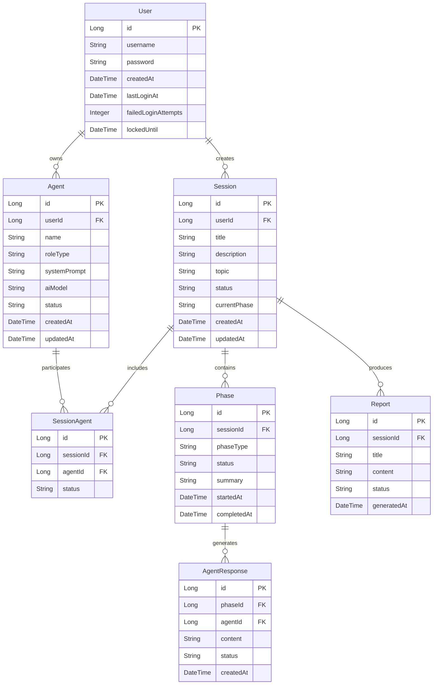

# 设计文档

## 概述

意启头脑风暴平台是一个基于Spring Boot的后端系统，采用RESTful API架构，集成七牛云AI推理服务和阿里云图像生成服务。系统支持多用户、多代理的并行头脑风暴会话，通过三阶段结构化流程生成文创产品解决方案。

## 架构

### 整体架构

```
┌─────────────────┐    ┌─────────────────┐    ┌─────────────────┐
│   前端应用       │────│   Spring Boot   │────│   外部AI服务     │
│   (React/Vue)   │    │   后端服务       │    │   (七牛云/阿里云) │
└─────────────────┘    └─────────────────┘    └─────────────────┘
                              │
                       ┌─────────────────┐
                       │   MySQL数据库    │
                       └─────────────────┘
```

### 技术栈

- **框架**: Spring Boot 2.7+
- **数据库**: MySQL 8.0
- **ORM**: MyBatis Plus
- **缓存**: Redis (可选，用于会话状态)
- **并发处理**: Java CompletableFuture + ThreadPoolExecutor
- **HTTP客户端**: OkHttp3
- **JSON处理**: Jackson
- **API文档**: Swagger/OpenAPI 3

### 分层架构

```
┌─────────────────────────────────────────┐
│              Controller Layer           │  ← REST API端点
├─────────────────────────────────────────┤
│              Service Layer              │  ← 业务逻辑处理
├─────────────────────────────────────────┤
│              Repository Layer           │  ← 数据访问层
├─────────────────────────────────────────┤
│              External API Layer         │  ← 外部服务集成
└─────────────────────────────────────────┘
```

## 组件和接口

### 核心组件

#### 1. 用户管理组件 (UserManagement)

**接口定义:**
```java
@RestController
@RequestMapping("/api/users")
public class UserController {
    @PostMapping("/register")
    ResponseEntity<UserResponse> register(@RequestBody RegisterRequest request);
    
    @PostMapping("/login") 
    ResponseEntity<LoginResponse> login(@RequestBody LoginRequest request);
    
    @PostMapping("/logout")
    ResponseEntity<Void> logout(@RequestHeader("Authorization") String token);
}
```

**核心服务:**
- `UserService`: 用户注册、登录、会话管理
- `AuthenticationService`: JWT令牌生成和验证
- `LoginAttemptService`: 登录失败次数跟踪和账户锁定

#### 2. AI代理管理组件 (AgentManagement)

**接口定义:**
```java
@RestController
@RequestMapping("/api/agents")
public class AgentController {
    @PostMapping
    ResponseEntity<AgentResponse> createAgent(@RequestBody CreateAgentRequest request);
    
    @GetMapping
    ResponseEntity<List<AgentResponse>> listAgents(@RequestParam Long userId);
    
    @PutMapping("/{agentId}")
    ResponseEntity<AgentResponse> updateAgent(@PathVariable Long agentId, @RequestBody UpdateAgentRequest request);
    
    @DeleteMapping("/{agentId}")
    ResponseEntity<Void> deleteAgent(@PathVariable Long agentId);
}
```

**核心服务:**
- `AgentService`: 代理CRUD操作和配置管理
- `AgentValidationService`: 代理配置验证
- `AgentVersionService`: 代理历史版本管理

#### 3. 头脑风暴会话组件 (BrainstormSession)

**接口定义:**
```java
@RestController
@RequestMapping("/api/sessions")
public class SessionController {
    @PostMapping
    ResponseEntity<SessionResponse> createSession(@RequestBody CreateSessionRequest request);
    
    @PostMapping("/{sessionId}/start")
    ResponseEntity<Void> startSession(@PathVariable Long sessionId, @RequestBody StartSessionRequest request);
    
    @PostMapping("/{sessionId}/phases/{phaseType}/approve")
    ResponseEntity<Void> approvePhase(@PathVariable Long sessionId, @PathVariable PhaseType phaseType);
    
    @PostMapping("/{sessionId}/phases/{phaseType}/reject")
    ResponseEntity<Void> rejectPhase(@PathVariable Long sessionId, @PathVariable PhaseType phaseType);
    
    @GetMapping("/{sessionId}/status")
    ResponseEntity<SessionStatusResponse> getSessionStatus(@PathVariable Long sessionId);
}
```

**核心服务:**
- `SessionService`: 会话生命周期管理
- `PhaseService`: 三阶段流程控制
- `SessionStateService`: 会话状态跟踪和持久化

#### 4. AI推理处理组件 (AIInference)

**接口定义:**
```java
@Component
public class AIInferenceService {
    CompletableFuture<AgentResponse> processAgentThinking(Agent agent, String prompt, SessionContext context);
    
    List<AgentResponse> processParallelInference(List<Agent> agents, String prompt, SessionContext context);
    
    String generatePhaseSummary(List<AgentResponse> responses, PhaseType phaseType);
}
```

**核心服务:**
- `QiniuAIService`: 七牛云AI推理API集成
- `AliyunImageService`: 阿里云图像生成API集成
- `InferenceExecutorService`: 并行推理任务执行
- `RetryService`: 请求重试和错误处理

#### 5. 报告生成组件 (ReportGeneration)

**接口定义:**
```java
@RestController
@RequestMapping("/api/reports")
public class ReportController {
    @PostMapping("/{sessionId}/generate")
    ResponseEntity<ReportResponse> generateReport(@PathVariable Long sessionId);
    
    @GetMapping("/{reportId}")
    ResponseEntity<ReportDetailResponse> getReport(@PathVariable Long reportId);
    
    @GetMapping("/{reportId}/pdf")
    ResponseEntity<byte[]> exportToPdf(@PathVariable Long reportId);
    
    @GetMapping("/user/{userId}")
    ResponseEntity<List<ReportSummaryResponse>> listUserReports(@PathVariable Long userId);
}
```

**核心服务:**
- `ReportService`: 报告生成和管理
- `ReportTemplateService`: 报告模板处理
- `PDFExportService`: PDF导出功能

## 数据模型

### 数据库设计原则

1. **规范化**: 遵循第三范式，减少数据冗余
2. **索引优化**: 为查询频繁的字段添加索引
3. **字符集**: 使用utf8mb4支持完整的Unicode字符
4. **存储引擎**: 使用InnoDB支持事务和外键约束
5. **命名规范**: 表名使用下划线分隔，字段名采用驼峰命名

### 核心实体关系图



### 表结构详细设计

#### 1. 用户表 (users)
- **主键**: id (BIGINT, AUTO_INCREMENT)
- **唯一索引**: username
- **普通索引**: last_login_at, created_at
- **字段约束**: username NOT NULL, password NOT NULL

#### 2. AI代理表 (agents)
- **主键**: id (BIGINT, AUTO_INCREMENT)
- **外键**: user_id REFERENCES users(id)
- **普通索引**: user_id, role_type, status
- **字段约束**: name NOT NULL, role_type NOT NULL, system_prompt TEXT

#### 3. 头脑风暴会话表 (brainstorm_sessions)
- **主键**: id (BIGINT, AUTO_INCREMENT)
- **外键**: user_id REFERENCES users(id)
- **普通索引**: user_id, status, created_at
- **字段约束**: title NOT NULL, status NOT NULL

#### 4. 会话代理关联表 (session_agents)
- **主键**: id (BIGINT, AUTO_INCREMENT)
- **外键**: session_id REFERENCES brainstorm_sessions(id), agent_id REFERENCES agents(id)
- **唯一索引**: (session_id, agent_id)
- **普通索引**: session_id, agent_id

#### 5. 阶段表 (phases)
- **主键**: id (BIGINT, AUTO_INCREMENT)
- **外键**: session_id REFERENCES brainstorm_sessions(id)
- **普通索引**: session_id, phase_type, status
- **字段约束**: phase_type NOT NULL, status NOT NULL

#### 6. 代理响应表 (agent_responses)
- **主键**: id (BIGINT, AUTO_INCREMENT)
- **外键**: phase_id REFERENCES phases(id), agent_id REFERENCES agents(id)
- **普通索引**: phase_id, agent_id, created_at
- **字段约束**: content TEXT NOT NULL

#### 7. 报告表 (reports)
- **主键**: id (BIGINT, AUTO_INCREMENT)
- **外键**: session_id REFERENCES brainstorm_sessions(id)
- **普通索引**: session_id, generated_at
- **字段约束**: title NOT NULL, content LONGTEXT

### 枚举类型定义

```java
public enum PhaseType {
    IDEA_GENERATION("创意生成"),
    FEASIBILITY_ANALYSIS("技术可行性分析"), 
    CRITICISM_DISCUSSION("缺点讨论");
}

public enum SessionStatus {
    CREATED("已创建"),
    IN_PROGRESS("进行中"),
    PAUSED("已暂停"),
    COMPLETED("已完成"),
    CANCELLED("已取消");
}

public enum AgentStatus {
    ACTIVE("活跃"),
    INACTIVE("非活跃"),
    DELETED("已删除");
}

public enum PhaseStatus {
    NOT_STARTED("未开始"),
    IN_PROGRESS("进行中"),
    WAITING_APPROVAL("等待审核"),
    APPROVED("已通过"),
    REJECTED("已拒绝"),
    COMPLETED("已完成");
}
```

## 错误处理

### 异常层次结构

```java
public class YiQiException extends RuntimeException {
    private final String errorCode;
    private final String message;
}

public class UserNotFoundException extends YiQiException {}
public class AgentNotFoundException extends YiQiException {}
public class SessionNotFoundException extends YiQiException {}
public class AIServiceException extends YiQiException {}
public class ValidationException extends YiQiException {}
public class AuthenticationException extends YiQiException {}
```

### 全局异常处理

```java
@ControllerAdvice
public class GlobalExceptionHandler {
    @ExceptionHandler(YiQiException.class)
    ResponseEntity<ErrorResponse> handleYiQiException(YiQiException e);
    
    @ExceptionHandler(ValidationException.class)
    ResponseEntity<ErrorResponse> handleValidationException(ValidationException e);
    
    @ExceptionHandler(Exception.class)
    ResponseEntity<ErrorResponse> handleGenericException(Exception e);
}
```

### 错误响应格式

```json
{
    "success": false,
    "errorCode": "AGENT_NOT_FOUND",
    "message": "指定的AI代理不存在",
    "timestamp": "2024-01-15T10:30:00Z",
    "path": "/api/agents/123"
}
```

## 测试策略

### 测试层次

1. **单元测试**
   - Service层业务逻辑测试
   - Repository层数据访问测试
   - Utility类功能测试
   - 覆盖率目标: 80%+

2. **集成测试**
   - Controller层API测试
   - 数据库集成测试
   - 外部API集成测试
   - 多线程并发测试

3. **端到端测试**
   - 完整头脑风暴流程测试
   - 用户认证流程测试
   - 报告生成流程测试

### 测试工具和框架

- **JUnit 5**: 单元测试框架
- **Mockito**: Mock对象创建
- **TestContainers**: 数据库集成测试
- **WireMock**: 外部API模拟
- **Spring Boot Test**: Spring集成测试

### 并发测试策略

```java
@Test
public void testParallelAgentInference() {
    // 模拟多个代理并行推理
    List<Agent> agents = createTestAgents(5);
    String prompt = "设计一个环保主题的帆布袋";
    
    long startTime = System.currentTimeMillis();
    List<AgentResponse> responses = aiInferenceService.processParallelInference(agents, prompt, context);
    long endTime = System.currentTimeMillis();
    
    assertThat(responses).hasSize(5);
    assertThat(endTime - startTime).isLessThan(10000); // 应在10秒内完成
}
```

## 外部服务集成

### 七牛云AI推理API集成

```java
@Service
public class QiniuAIService {
    private final OkHttpClient httpClient;
    private final String apiKey;
    private final String baseUrl = "https://api.qiniu.com/ai/inference";
    
    public CompletableFuture<String> sendInferenceRequest(String model, String prompt, String systemPrompt) {
        return CompletableFuture.supplyAsync(() -> {
            // 构建请求
            RequestBody requestBody = buildRequestBody(model, prompt, systemPrompt);
            Request request = new Request.Builder()
                .url(baseUrl + "/chat")
                .post(requestBody)
                .addHeader("Authorization", "Bearer " + apiKey)
                .build();
            
            // 发送请求并处理响应
            try (Response response = httpClient.newCall(request).execute()) {
                return parseResponse(response);
            } catch (IOException e) {
                throw new AIServiceException("AI推理请求失败", e);
            }
        });
    }
}
```

### 阿里云图像生成API集成

```java
@Service
public class AliyunImageService {
    private final String accessKeyId;
    private final String accessKeySecret;
    private final String endpoint = "https://dashscope.aliyuncs.com/api/v1/services/aigc/text2image/image-synthesis";
    
    public CompletableFuture<String> generateImage(String prompt, String style) {
        return CompletableFuture.supplyAsync(() -> {
            // 实现图像生成逻辑
            return callAliyunImageAPI(prompt, style);
        });
    }
}
```

### 数据库文件说明

#### schema.sql
- 包含完整的数据库结构定义
- 8个核心表：users, agents, brainstorm_sessions, session_agents, phases, agent_responses, reports, agent_versions
- 完整的索引设计和外键约束
- 支持utf8mb4字符集，兼容emoji和特殊字符

#### data.sql  
- 包含演示用的初始化数据
- 预设用户账户和AI代理角色
- 示例头脑风暴会话和阶段数据
- 便于快速启动和测试

#### 数据库设计亮点
1. **性能优化**: 为查询频繁的字段添加索引
2. **数据完整性**: 使用外键约束保证数据一致性
3. **扩展性**: 代理版本表支持配置历史追踪
4. **灵活性**: JSON格式存储报告内容，支持复杂数据结构

### API配置管理

完整的配置文件已创建在 `application.yml` 中，包含：
- 数据库连接配置
- AI服务API配置（七牛云、阿里云）
- 线程池配置
- JWT认证配置
- 文件上传配置
- 日志配置
- Swagger文档配置